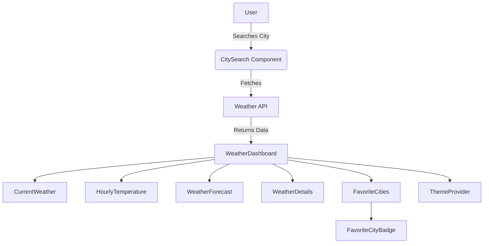

# 🌦️ Modern Weather App

A beautiful, fast, and modern weather dashboard built with **React**, **TypeScript**, **Vite**, and **Tailwind CSS**. Get real-time weather updates, 5-day forecasts, and manage your favorite cities with a sleek, responsive UI.

---


## ✨ Features

- **Current Weather**: Real-time weather for your location or any searched city
- **5-Day Forecast**: Detailed daily and hourly forecasts
- **Favorite Cities**: Save, view, and remove your favorite locations
- **Search History**: Quickly revisit recent searches
- **Responsive Design**: Looks great on all devices
- **Dark/Light Mode**: Toggle between themes
- **Interactive Charts**: Visualize hourly temperature trends
- **Toast Notifications**: Instant feedback for actions

## 🖼️ Architecture Diagram



## 🚀 Getting Started

1. **Clone the repo:**
   ```sh
   git clone https://github.com/your-username/modern-weather-app.git
   cd modern-weather-app
   ```
2. **Install dependencies:**
   ```sh
   npm install
   ```
3. **Set up API key:**
   - Get a free API key from [OpenWeatherMap](https://openweathermap.org/api)
   - Create a `.env` file in the root:
     ```env
     VITE_OPENWEATHER_API_KEY=your_api_key_here
     ```
4. **Run the app:**
   ```sh
   npm run dev
   ```
5. **Open in browser:**
   Visit [http://localhost:3000](http://localhost:3000)

## 🛠️ Tech Stack

- React + TypeScript
- Vite
- Tailwind CSS
- Tanstack Query
- OpenWeatherMap API
- ShadCN/ui & Lucide Icons

## 📁 Project Structure

```
├── src/
│   ├── api/           # API configs & types
│   ├── components/    # UI & feature components
│   ├── context/       # Theme provider
│   ├── hooks/         # Custom React hooks
│   ├── lib/           # Utilities
│   └── pages/         # Page components
├── public/            # Static assets
├── index.html         # App entry
├── tailwind.config.js # Tailwind config
└── ...
```

## 🙏 Credits

- [OpenWeatherMap](https://openweathermap.org/)
- [Vite](https://vitejs.dev/)
- [Tailwind CSS](https://tailwindcss.com/)
- [Radix UI](https://www.radix-ui.com/)
- [Lucide Icons](https://lucide.dev/)
- [ShadCN/ui](https://ui.shadcn.com/) <!-- UI components inspiration -->

---

> Made with ❤️ by Masudur Rahman Sourav
